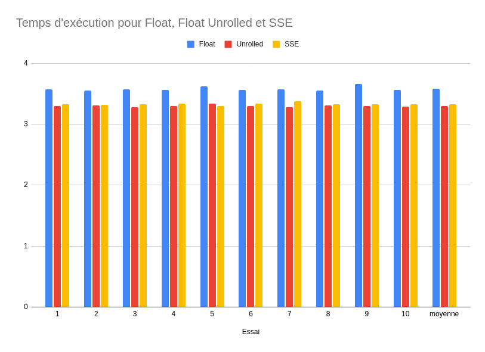

# Single Instruction Multiple Data (SIMD) instructions overview - MJPEG video decoding
The goal of this practical work is to use SIMD (Single Instruction, Multiple Data) x86_64 operations, and more particularly Intel's SSE extensions in order to decode a video in motion jpeg (MJPEG) format, and to work on registers of 128 bits.

## Prerequisites
The execution requires an Intel x86_64 processor and the SDL1.2 library (or SDL12-compat).
SSE instructions' documentation is available on Intel's website : [Intel Intrinsics Guide](https://www.intel.com/content/www/us/en/docs/intrinsics-guide/index.html#expand=undefined&techs=SSE_ALL)

## Compiling and running
Everything we need is in the folder `tp2_src_etd`.

The video to be decoded is : `tp2_src_etd/ice_age_256x144_444.mjpeg`.
The three implementations of float conversion are as follows:
- `conv-float.c` : "classic" float conversion, without any particular optimization
- `conv-unrolled4-float-a-trou.c` : conversion of 4 by 4 floats compared to the classic implementation
- `conv-sse-a-trou.c` : converting 4 by 4 floats using 128-bit registers and SSE instructions

To compile one of these conversion methods, just use:
```
make <mjpeg-float | mjpeg-conv-unrolled4-float-a-trou | mjpeg-conv-sse-a-trou>
```

The created executable takes 1, 2 or 3 arguments. The first one is the name of the video (`ice_age_256x144_444.mjpeg`), the second is an integer giving the number of frames to decode (`-1` if all), and the third, which is not mandatory, makes it possible not to display the result: we can then measure the raw speed of the decoding.

Then, to see how long the decoding takes on the full movie, just run:
```
time ./mjpeg-float ice_age_256x144_444.mjpeg -1 azerty
```

## Results
On the three implementations presented and on 10 executions for each, I obtained the following results:



We can see that the Float Unrolled and SSE implementations are slightly faster than the classic Float implementation, but that the use of SSE instructions, on the machine on which I carried out this work, does not necessarily offer better performance than 4 by 4 conversion.

This work was done as part of the Conception and Exploration of multi-core architectures course given in the last year of the Information Systems Engineering specialization at Grenoble INP - Ensimag, UGA.
